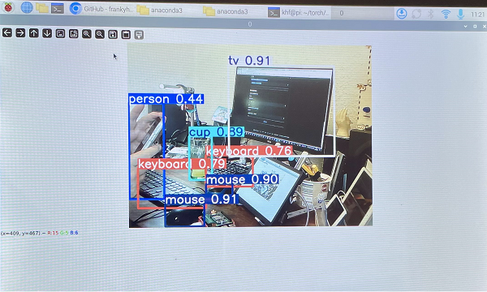

<a name="oben"></a>

<div align="center">

# Objekterkennung mit yolov5


|[:skull:ISSUE](https://github.com/KI4kids/01_KI4Kids_Object/issues?q=is%3Aissue)|[:speech_balloon: Forum /Discussion](https://github.com/KI4kids/01_KI4Kids_Object/discussions)|[:grey_question:WiKi](https://github.com/KI4kids/01_KI4Kids_Object/blob/main/wiki.md)|
|--|--|--|
| | | | 
| <a href="https://github.com/KI4kids/01_KI4Kids_Object/pulse" alt="Activity">| <a href="https://github.com/KI4kids/01_KI4Kids_Object/graphs/traffic">  |<a href="https://github.com/frankyhub?tab=stars"> |


</div>

## Story
Künstliche Intelligenz (KI) bezeichnet die Fähigkeit von Maschinen, menschenähnliche Intelligenzleistungen zu erbringen. Das umfasst das Lernen aus Erfahrungen, das Verstehen von Sprache, das Treffen von Entscheidungen und das Lösen komplexer Probleme. Im Wesentlichen geht es darum, Computer so zu programmieren, dass sie Aufgaben erledigen können, die normalerweise menschliche Intelligenz erfordern.

Dieses Repo beschreibt die Objekterkennung mit einer KI. KI-Objekterkennung ist ein Teil des Fablab Oberland Bildungsprogramms. Ziel ist es, mit den Modellen Yolov5, OpenCV und Pytorch eine Objekterkennung auf dem Raspberry Pi 5 zu installieren.

## Ablauf:

- Inbetriebnahme des Raspberry Pi

- Virtual Environments mit Anaconda
  
- Aufgaben der KI Modelle
  
- Installation der KI Modelle
  
- Die KI Modelle anhand von Beispielen testen
  
- Die Objekterkennung mit Bilder testen

- Eine KI mit colab erstellen
  
- Die Objekterkennung mit der Kamera testen
  
- Objekte mit der Kamera zählen




---

<!---

## Vorbereitung

## Raspberry Pi Imager

[Link](https://www.raspberrypi.com/software/)


## EEPROM Updade

Versionskontrolle
```
sudo rpi-eeprom-update
```

Update ausführen
```
sudo rpi-eeprom-update -d -a
```

## Ubuntu – Update und Upgrade

Bash (Bourne Again Shell) ist die freie und erweiterte Version der Bourne-Shell, die zu den Betriebssystemen Linux und GNU gehört.

Superuser Do (sudo), Advanced Package Tool (APT)

bash
```sh
sudo apt update && sudo apt upgrade -y
```
--->

## Linux Standard Base - Versionsabfrage
bash

```bash
lsb_release -a
```

| | |
|--|--|
|Distributor ID: | Debian|
|Description:|Debian GNU/Linux 12 (bookworm)|
|Relaese:|12|
|Codename:|bookworm|
| | |

---

## Anaconda 

Anaconda ist eine Python-Distribution für Datenverarbeitung von großen Mengen, vorhersagende Analyse und wissenschaftliche Berechnungen. Bestandteile des Anaconda Pakets sind NumPy, SciPy, matplotlib, pandas, IPython, Jupyter Notebook, scikit-learn und der Bibliothek Intel MKL.

### Versions-Kontrolle: https://repo.anaconda.com/archive/


### Anaconda installieren

bash
```sh
wget https://repo.anaconda.com/archive/Anaconda3-2025.06-0-Linux-aarch64.sh
```

cd tmp

bash
```sh
sh Anaconda3-2025.06-0-Linux-aarch64.sh
```

- press ENTER to continue
- q (Lizenzvereinbarungen mit q Abbrechen)
- yes (Installation in /home/khf/anaconda3)
- enter (Installing base environment)
- yes (running conda)


```diff

! *** Die Shell neu starten *** !

```


Ist Anaconda korrekt installiert?

bash

```
conda --version

```

Kontrolle:

conda 25.5.1

(base) khf@pi:~/temp $

---

### Python kontrollieren:

bash

```
python --version 
```
Python 3.13.5 

---
## Virtual Environments in Anaconda (Virtuelle Umgebungen) 

In der Softwareentwicklung, besonders in Python, gibt es den Begriff der virtuellen Umgebung oder virtual environment. Das ist eine isolierte Umgebung, in der du Software-Bibliotheken installieren kannst, ohne die globale Installation von Bibliotheken auf deinem System zu verändern. Dies ist besonders nützlich, um Versionskonflikte zwischen verschiedenen Projekten zu vermeiden.

### Das Environment object installieren

bash

```
conda env list
```

```
conda create -n object
```

```
conda activate object
```

```
conda env list
```

### So könnte man das Environment object wieder löschen

```
conda remove -n object --all
```
---
---
## Modelle und Datensätze

### Modelle
- yolo von Ultralytics
- OpenCV von Intel
- Pytorch  wurde von Meta AI (ehemals Facebook AI Research Lab) entwickelt seit 2017 Open source
- keras von google, jetzt Open source 
- TensorFlow von google

### Datensätze
- coco von Ultralytics
- kaggle von google 
- aws von Amazon web Service
- Open X-Embodiment Dataset und 
- Open-Physical-Interaction Dataset Collection von NVIDIA


--- 

### USB-Kamera testen

Der Code erfasst den Videostream, der von der Kamera generiert wird, und zeigt sowohl im BGR-Farb- als auch im Graumodus an. Mit q wird er beendet.

```
cd
```
```
mkdir camtest
```
```
cd camtest
```


```Python
# camtest.py
# Video mit der USB-Kamera

import numpy as np
import cv2

cap = cv2.VideoCapture(0)

while(True):
    # Bild für Bild erfassen
    ret, frame = cap.read()

    # Die Bilder im Frame
    gray = cv2.cvtColor(frame, cv2.COLOR_BGR2GRAY)
   
    # Zeige den Frame an
    cv2.imshow('frame',frame)  #In Farbe
    #cv2.imshow('gray',gray)    #In SW

    if cv2.waitKey(20) & 0xFF == ord('q'):
        break

# Programm beenden
cap.release()
cv2.destroyAllWindows()

```

```
python camtest.py
```

```diff

! *** Der camtest funktioniert nicht, da OpenCV noch nicht installiert ist *** !

```
### OpenCV 

OpenCV (Open Source Computer Vision Library) wurde ursprünglich von Intel im Jahr 1999 initiiert und ist seitdem zu einer der beliebtesten Bibliotheken für Computer Vision geworden. 
Die Bibliothek wurde entwickelt, um Forschern und Entwicklern eine einfache und effiziente Möglichkeit zu bieten, Computer Vision in Echtzeitanwendungen zu integrieren.
So wurde OpenCV ein beliebtes und umfassende Model für Computervisionsaufgaben und bietet eine Vielzahl von Tools und Algorithmen für die Bild- und Videoverarbeitung, Objekterkennung und Gesichtserkennung.


pip Installer

pip install ist ein Befehl, der im Python-Paketmanager pip verwendet wird, um Python-Pakete aus dem Python Package Index (PyPI) oder anderen Quellen zu installieren. Im Wesentlichen ermöglicht er die Installation, Aktualisierung und Verwaltung von Python-Softwarepaketen.


```
conda install anaconda::pip

```
OpenCV Standardpaket installieren

```
pip install opencv-python
```

Zusätzliche OpenCV Funktionen installieren

```
pip install opencv-contrib-python
```

### USB-Cam testen
```
python camtest.py
```

### Das Environment testen

```
conda deactivate
```

```
conda activate 
```

```
cd camtest
```

```
python camtest.py
```

```diff

! *** Der camtest funktioniert nicht, da OpenCV im base Environment noch nicht installiert ist *** !

```


### Das object Environment aktivieren


```
conda activate object
```
```
python camtest.py
```

<!---
OpenCV contrib Library

```
pip install opencv-contrib-python

```
--->

## CV2 Beispiele

### cv2.VideoWriter

Speichert das Video der USB-Kamera

```
# save video.py
# Speichert das Video der USB-Kamera

##cv2: OpenCV für Videoverarbeitung.
import numpy as np
import cv2 

#Öffnet die erste USB-Kamera (Index 0).
#cap ist das Kamera-Objekt.
cap = cv2.VideoCapture(0) 

# Erstellen des VideoWriter-Objekts
# Gibt den Codec mit 20 Bilder pro Sekunde an (XVID, für AVI-Dateien).
fourcc = cv2.VideoWriter_fourcc(*'XVID')
out = cv2.VideoWriter('myvideo.avi',fourcc, 20.0, (640,480)) #Größe des Videos in Pixeln (Breite × Höhe)

while(cap.isOpened()): #Prüft, ob die Kamera erfolgreich geöffnet wurde.
    ret, frame = cap.read() #ret == True: Bild erfolgreich gelesen, frame: Das gelesene Bild
    if ret==True:
        #frame = cv2.flip(frame,1) # Video spiegeln

        # Zeige das Video
        out.write(frame) #out.write(frame): Speichert das aktuelle Bild im Video.

        cv2.imshow('frame',frame) #imshow: Zeigt das aktuelle Bildfenster live an.
        if cv2.waitKey(1) & 0xFF == ord('q'):
            break
    else:
        break

# Abbruch durch Tastendruck
cap.release() #Kamera freigeben
out.release() #Videodatei schließen (wichtig!)
cv2.destroyAllWindows() #Fenster schließen
```
---
### Lade Bilddateien

```
#dlpic.py

import os
import shutil
import urllib.request
import zipfile

# Wechsle in das Home-Verzeichnis 
os.chdir(os.path.expanduser("~"))

# Erstelle den Ordner  mp4
os.makedirs("pic", exist_ok=True)

# Wechsle in das Home-Verzeichnis 
os.chdir(os.path.expanduser("~"))


# Wechsle in den Ordner
os.chdir("pic")

# Hilfsfunktion zum Herunterladen von Dateien
def download_file(url, filename=None):
    if not filename:
        filename = url.split("/")[-1]
    print(f"Downloading {filename} ...")
    urllib.request.urlretrieve(url, filename)

# Hilfsfunktion zum Entpacken und Löschen von ZIP-Dateien
def unzip_and_remove(zip_filename):
    print(f"Unzipping {zip_filename} ...")
    with zipfile.ZipFile(zip_filename, 'r') as zip_ref:
        zip_ref.extractall(".")
    os.remove(zip_filename)

download_file("https://frankyhub.de/KI_pic/pic.zip")
unzip_and_remove("pic.zip")

# Zeige den Inhalt des aktuellen Verzeichnisses
print("Inhalt von pic:")
print(os.listdir("."))

# Wechsle in das Home-Verzeichnis 
os.chdir(os.path.expanduser("/home/khf/camtest"))
```

### cv2.add

Fügt ein Logo in das erste Bild ein

#### Bild (gmund.png)


#### Logo (logo.png)


#### Das Logo ist in das Bild eingefügt


```
# logoeinf.py
# Fügt ein Logo in das erste Bild ein

import cv2
# Lode das Bild und das Logo
img1 = cv2.imread('gmund.png')
img2 = cv2.imread('logo.png')

# Ich möchte das Logo in der oberen linken Ecke platzieren, also erstelle ich eine ROI (Region Of Interest)
# Erstelle einen Bildausschnitt (ROI) aus dem Bild img1, der von Zeile 0 bis rows und von Spalte 0 bis cols geht.
rows,cols,channels = img2.shape
roi = img1[0:rows, 0:cols ]

# Erstelle eine Maske des Logos 
img2gray = cv2.cvtColor(img2,cv2.COLOR_BGR2GRAY)
ret, mask = cv2.threshold(img2gray, 10, 255, cv2.THRESH_BINARY)
mask_inv = cv2.bitwise_not(mask)

# Schwärze jetzt den Bereich des Logos in der ROI (Region of Interest)
img1_bg = cv2.bitwise_and(roi,roi,mask = mask_inv)

# Nehme den Bereich des Logos aus dem Logobild
img2_fg = cv2.bitwise_and(img2,img2,mask = mask)

# Setze das Logo in die ROI und ändere das Hauptbild
dst = cv2.add(img1_bg,img2_fg)
img1[0:rows, 0:cols ] = dst

cv2.imshow('Resultat',img1)
cv2.waitKey(0)
cv2.destroyAllWindows()

```


---


## Yolov5

YOLOv5 ist ein beliebtes und leistungsstarkse Open-Source-Model für die Objekterkennung, die von Ultralytics entwickelt wurde. Sie basiert auf der YOLO-Familie (“You Only Look Once”), einer Reihe von Modellen für Echtzeit-Objekterkennung. YOLOv5 bietet mit den Datandatz coco schnelle und präzise Ergebnisse, ist einfach zu bedienen und wird häufig für Computer-Vision-Aufgaben eingesetzt.

Der COCO-Datensatz (Common Objects in Context) ist ein umfangreicher Datensatz für Objekterkennung, Segmentierung und Beschriftung. Er wurde entwickelt, um die Forschung an einer Vielzahl von Objektkategorien zu fördern und wird häufig zum Benchmarking von Computer-Vision-Modellen verwendet. Er ist ein wesentlicher Datensatz für Forscher und Entwickler, die an Objekterkennung, Segmentierung und Posenschätzung arbeiten.

Ultralytics COCO128 ist ein kleiner, aber vielseitiger Objekterkennungsdatensatz, der aus den ersten 128 Bildern des COCO-Train-Sets 2017 besteht. Dieser Datensatz ist ideal zum Testen und Debuggen von Objekterkennungsmodellen oder zum Experimentieren mit neuen Erkennungsansätzen.


Der coco Datensatz ist in drei Teile aufgeteilt: Training, Validierung und Test. Beim maschinellen Lernen werden die 
Datensätze Training, Validierung und Test dazu verwendet, dem Algorithmen beizubringen, Muster in den Daten zu erkennen.

- Der Trainingsdatensatz ist der Datensatz, der dem Algorithmus beibringt, wonach er suchen soll.
- Ein Validierungsdatensatz ist eine Sammlung erprobter guter Daten, an denen der Algorithmus getestet werden kann.
- Der Testdatensatz ist die endgültige Sammlung von Daten mit unbekanntem Inhalt, anhand derer die Leistung gemessen wird.

  


Die mittlere durchschnittliche Genauigkeit mAP (Mean Average Precision)


Architektur der neuronalen Vernetzung von yolo Modellen. Ein Neuron erhält Signale von mehreren anderen Neuronen.


## Wie arbeitet ein neuronales Netz?

<!--- https://datasolut.com/neuronale-netzwerke-einfuehrung/ --->

In einem neuronalen Netz ahmen künstliche Neuronen durch Algorithmen die Nervenzellen des menschlichen Gehirn nach. Es besteht aus einer Vielzahl von Neuronen, die miteinander verbunden sind. Diese Verbindungen, oft als Knoten bezeichnet, übertragen Informationen von einem Neuron zum nächsten. Jede Verbindung hat ein Gewicht, das bestimmt, wie stark die Information übertragen wird. Die Aktivierungsfunktion bestimmt, ob ein Neuron die Information weitergibt oder nicht, basierend auf den empfangenen Informationen.


Der Aufbau eines Künstlichen Neuronalen Netzes (KNN) besteht aus den Schichten: Eingabeschicht (Input Layer), verborgene Schicht (Hidden Layer) und Ausgabeschicht (Output Layer).


### Eingabeschicht: 
Die Eingangsschicht versorgt das neuronale Netz mit den notwendigen Informationen. Die Input-Neuronen verarbeiten die eingegebenen Daten und führen diese gewichtet an die nächste Schicht weiter.   

### Verborgene Schicht: 
Die verborgene Schicht befindet sich zwischen der Eingabeschicht und der Ausgabeschicht. Während die Ein- und Ausgabeschicht lediglich aus einer Ebene bestehen, können beliebig viele Ebenen an Neuronen in der verborgenen Schicht vorhanden sein. Hier werden die empfangenen Informationen erneut gewichtet und von Neuron zu Neuron bis zur Ausgabeschicht weitergereicht. Die Gewichtung findet in jeder Ebene der verborgenen Schicht statt. Die genaue Prozessierung der Informationen ist jedoch nicht sichtbar. Daher stammt auch der Name, verborgene Schicht. Während in der Ein- und Ausgabeschicht die eingehenden und ausgehenden Daten sichtbar sind, ist der innere Bereich des Neuronalen Netzes im Prinzip eine Black Box.


### Ausgabeschicht: 
Die Ausgabeschicht ist die letzte Schicht und schließt unmittelbar an die letzte Ebene der verborgenen Schicht an. Die Output-Neuronen beinhalten die resultierende Entscheidung, die als Informationsfluss hervorgeht.


Bei dieser Netzstruktur bekommt jedes Neuron ein zufälliges Anfangsgewicht zugeteilt. Dann werden die Eingangsdaten in das Netz gegeben und von jedem Neuron mit seinem individuellen Gewicht gewichtet.

Das Ergebnis dieser Berechnung wird an die nächsten Neuronen der nächsten Schicht oder des nächsten Layers weitergegeben, man spricht auch von einer „Aktivierung der Neuronen“. Eine Berechnung des Gesamtergebnis geschieht am Outputlayer.

Natürlich sind, wie bei jedem maschinellen Lernverfahren, nicht alle Ergebnisse (Outputs) korrekt und es treten Fehler auf. Diese Fehler sind berechenbar, ebenso wie der Anteil eines einzelnen Neurons am Fehler. Im nächsten Lerndurchgang (Deep Learning) wird das Gewicht jedes Neurons so verändert, dass der Fehler minimiert wird.

Im nächsten Durchlauf wird der Fehler erneut gemessen und angepasst. Auf diese Weise „lernt“ das neuronale Netz von Mal zu Mal besser, von den Eingabedaten auf bekannte Ausgabedaten zu schließen.


---


### Download yolov5:

bash

```
cd
```

bash

(git intallieren: sudo apt install git-all)

```
git clone https://github.com/ultralytics/yolov5 ~/object

```

bash

```
cd object
```

### yolov5 installieren

bash

```
pip install -r requirements.txt 
```

---
## Pytorch

PyTorch ist ein weiteres beliebtes Open-Source-Model für maschinelles Lernen, das von Facebook entwickelt wurde. 
Es kann auf den gängigen Betriebssystemen (Windows, macOS, Linux) und auch auf mobilen Geräten verwendet werden.
Mit TorchVision stellt PyTorch vortrainierte Modelle und eine Bibliothek zur Verfügung, die auch Objekterkennung unterstützen.


### Pytorch Beispiel

Aufgabe:

Mit Yolov5 ist auch Pytorch installiert worden. Wir testen Pytorch anhand eines Beispiels.

Erstelle ein Python Programm in dem die erste Zahlenreihe zwei, drei, vier ist und

die zweite Zahlenreihe vier, sechs, acht. Das Programm soll die vierte Zahl der zweiten

Zahlenreihe ermitteln, wenn die vierte Zahl der ersten Zahlenreihe fünf ist.

```
# zahl.py

import torch
import torch.nn as nn
import torch.optim as optim

# Definiere das Modell
class SimpleModel(nn.Module):
    def __init__(self):
        super(SimpleModel, self).__init__()
        # Wir haben 1 Eingabewert und wollen 1 Ausgabewert
        self.fc1 = nn.Linear(1, 1)  # 1 Eingabewert (Zahl der ersten Zahlenreihe), 1 Ausgabewert (Zahl der zweiten Zahlenreihe)

    def forward(self, x):
        return self.fc1(x)  # Lineare Vorhersage ohne Aktivierungsfunktion

# Gegebene Zahlenreihen
first_array = torch.tensor([2.0, 3.0, 4.0, 5.0]).view(-1, 1)  # Erste Zahlenreihe
second_array = torch.tensor([4.0, 6.0, 8.0, float('nan')]).view(-1, 1)  # Zweite Zahlenreihe, mit NaN für die vierte Zahl

# Eingabedaten: Wir verwenden die ersten drei Werte der ersten Zahlenreihe
inputs = first_array[:3]  # Erste 3 Werte der ersten Reihe
target = second_array[:3]  # Erste 3 Werte der zweiten Reihe (Zielwerte)

# Modell initialisieren
model = SimpleModel()

# Verlustfunktion und Optimierer
criterion = nn.MSELoss()  # Mean Squared Error Loss, geeignet für eine Fehlerbestimmung
optimizer = optim.SGD(model.parameters(), lr=0.01)  # Stochastic Gradient Descent (SGD)

# Training des Modells
epochs = 1000  # Anzahl der Trainings-Epochen

for epoch in range(epochs):
    model.train()

    # Vorwärtsdurchlauf
    output = model(inputs)
    
    # Berechne den Verlust
    loss = criterion(output, target)
    
    # Rückwärtsdurchlauf und Optimierung
    optimizer.zero_grad()
    loss.backward()
    optimizer.step()

    if epoch % 100 == 0:
        print(f'Epoche {epoch+1}, Fehler: {loss.item()}')

# Modell für Vorhersage verwenden
model.eval()  # Setzt das Modell in den Evaluationsmodus

# Vorhersage für die 4. Zahl der zweiten Reihe (bei Eingabe 5 der ersten Reihe)
input_value = torch.tensor([[5.0]])  # Die vierte Zahl der ersten Zahlenreihe
with torch.no_grad():
    predicted_value = model(input_value)

print(f"\nVorhersage für die vierte Zahl der zweiten Reihe, bei Eingabe 5 in der ersten Reihe: {predicted_value.item():.2f}")
```


---

## Programmieren mit colab

[](https://colab.research.google.com/drive/1wg-YMhOv8y0IE_Y9il5XN5YQJYymWN83#scrollTo=lVi4aSRqUXmp)

---


## Zahl vorhersagen mit colab

[](https://colab.research.google.com/drive/1VdH97RRoNZLY_h0besddK9EmTUe4N084)


---

---


## Start detection:


### Beispiel images

```
python detect.py --source data/images
```


## Teste dieses Bild


---


## Test in colab

[](https://colab.research.google.com/drive/1fHT0CNTEdMn43vEaB5gQYnfWJ9i8zFSL#scrollTo=hfwTe6E8PB5H)


## Python mit colab

[](https://colab.research.google.com/github/DSA-Kurs11-2021/python-intro/blob/main/python-colab.ipynb#scrollTo=sk_8DFcuL9ey)


<!---

## Matplotlib 3.10.3 documentation

[Link](https://matplotlib.org/stable/)


--->
---
## Yolov5 

### Beispiel web-cam

```
python detect.py --source 0
```


---


---

### Objekte zählen (USB-Cam)

Python

```
# objcount.py

import cv2
from ultralytics import YOLO

# Modell laden – du kannst auch ein anderes Modell angeben
model = YOLO('yolov5n.pt')  # 'n' steht für nano (schnell und leichtgewichtig)

# USB-Kamera öffnen (Index 0 = Standardkamera)
cap = cv2.VideoCapture(0)

if not cap.isOpened():
    print("Fehler beim Öffnen der Kamera.")
    exit()

while True:
    ret, frame = cap.read()
    if not ret:
        print("Fehler beim Lesen des Kamerabildes.")
        break

    # Objekt-Erkennung auf dem aktuellen Frame
    results = model(frame)

    # Alle erkannten Objekte auf dem Frame anzeigen
    annotated_frame = results[0].plot()

    # Objektanzahl ausgeben
    obj_count = len(results[0].boxes)
    cv2.putText(annotated_frame, f"Objekte: {obj_count}", (10, 30),
                cv2.FONT_HERSHEY_SIMPLEX, 1, (0, 255, 0), 2)

    # Bild anzeigen
    cv2.imshow("YOLOv5 Objekte zaehlen", annotated_frame)

    # Beenden mit 'q'
    if cv2.waitKey(1) & 0xFF == ord('q'):
        break

# Ressourcen freigeben
cap.release()
cv2.destroyAllWindows()


```


---
## Der Yolov5 Datensatz coco und die coco-Classes

```
# Classes
names:
  0: person
  1: bicycle
  2: car
  3: motorcycle
  4: airplane
  5: bus
  6: train
  7: truck
  8: boat
  9: traffic light
  10: fire hydrant
  11: stop sign
  12: parking meter
  13: bench
  14: bird
  15: cat
  16: dog
  17: horse
  18: sheep
  19: cow
  20: elephant
  21: bear
  22: zebra
  23: giraffe
  24: backpack
  25: umbrella
  26: handbag
  27: tie
  28: suitcase
  29: frisbee
  30: skis
  31: snowboard
  32: sports ball
  33: kite
  34: baseball bat
  35: baseball glove
  36: skateboard
  37: surfboard
  38: tennis racket
  39: bottle
  40: wine glass
  41: cup
  42: fork
  43: knife
  44: spoon
  45: bowl
  46: banana
  47: apple
  48: sandwich
  49: orange
  50: broccoli
  51: carrot
  52: hot dog
  53: pizza
  54: donut
  55: cake
  56: chair
  57: couch
  58: potted plant
  59: bed
  60: dining table
  61: toilet
  62: tv
  63: laptop
  64: mouse
  65: remote
  66: keyboard
  67: cell phone
  68: microwave
  69: oven
  70: toaster
  71: sink
  72: refrigerator
  73: book
  74: clock
  75: vase
  76: scissors
  77: teddy bear
  78: hair drier
  79: toothbrush

```


### Objekte der Klasse 39 zählen

```
# count39.py
# Zaehlt Objekte der Klasse 39 (Bottle)

import cv2
from ultralytics import YOLO

# Modell laden – du kannst auch ein anderes Modell angeben
model = YOLO('yolov5n.pt')  # 'n' steht für nano (schnell und leichtgewichtig)

# USB-Kamera öffnen (Index 0 = Standardkamera)
cap = cv2.VideoCapture(0)

if not cap.isOpened():
    print("Fehler beim Öffnen der Kamera.")
    exit()

while True:
    ret, frame = cap.read()
    if not ret:
        print("Fehler beim Lesen des Kamerabildes.")
        break

    # Objekt-Erkennung auf dem aktuellen Frame
    results = model(frame)

    # Alle erkannten Objekte auf dem Frame anzeigen
    annotated_frame = results[0].plot()

    # !!!!!!!!!!!  Nur Objekte der Klasse 39 zählen !!!!!!!!!!!!!!!!
    class_ids = results[0].boxes.cls.cpu().numpy()  # Klassennummern extrahieren
    class_39_count = (class_ids == 39).sum()

    # Anzeige der Anzahl
    cv2.putText(annotated_frame, f"Klasse 39: {class_39_count}", (10, 30),
                cv2.FONT_HERSHEY_SIMPLEX, 1, (0, 255, 0), 2)

    # Bild anzeigen
    cv2.imshow("YOLOv5 Objekte der Klasse 39 zaehlen", annotated_frame)

    # Beenden mit 'q'
    if cv2.waitKey(1) & 0xFF == ord('q'):
        break

# Ressourcen freigeben
cap.release()
cv2.destroyAllWindows()

```


### Download der png und mp4 Dateien

Python

```
#dlmp4.py

import os
import shutil
import urllib.request
import zipfile

# Wechsle in das Home-Verzeichnis 
os.chdir(os.path.expanduser("~"))

# Erstelle den Ordner  mp4
os.makedirs("mp4", exist_ok=True)

# Wechsle in das Home-Verzeichnis 
os.chdir(os.path.expanduser("~"))


# Wechsle in den Ordner
os.chdir("mp4")

# Hilfsfunktion zum Herunterladen von Dateien
def download_file(url, filename=None):
    if not filename:
        filename = url.split("/")[-1]
    print(f"Downloading {filename} ...")
    urllib.request.urlretrieve(url, filename)

# Hilfsfunktion zum Entpacken und Löschen von ZIP-Dateien
def unzip_and_remove(zip_filename):
    print(f"Unzipping {zip_filename} ...")
    with zipfile.ZipFile(zip_filename, 'r') as zip_ref:
        zip_ref.extractall(".")
    os.remove(zip_filename)

download_file("https://frankyhub.de/KI_mp4/mp4.zip")
unzip_and_remove("mp4.zip")

# Zeige den Inhalt des aktuellen Verzeichnisses
print("Inhalt von mp4:")
print(os.listdir("."))

# Wechsle in das Home-Verzeichnis 
os.chdir(os.path.expanduser("~"))


```


### Ändere das Programm count39.py so ab,  dass nur Fahrräder gezählt werden

Verwende das Video bike.mp4


[](https://colab.research.google.com/drive/1gWRux_rGjf0Y-FQ-vopFgO10c5e5OwKz#scrollTo=TYyUbXyR6MGR)

### Fahräder aus einem Video zählen

lade bike.mp4 in dein Arbeitsverzeichnis

```
#bikecount.py
# Lade bike.mp4 in dein Arbeitsverzeichnis

import cv2

from ultralytics import solutions

#cap = cv2.VideoCapture(0)
cap = cv2.VideoCapture("bike.mp4")
w, h, fps = (int(cap.get(x)) for x in (cv2.CAP_PROP_FRAME_WIDTH, cv2.CAP_PROP_FRAME_HEIGHT, cv2.CAP_PROP_FPS))
def change_res(width, height):
    cap.set(3,1200)
    cap.set(4,1200)

change_res(1200,1200)
            
region_points = [(50, 20), (300, 20), (300, 450), (50, 450)]


# Init ObjectCounter
counter = solutions.ObjectCounter(
    show=True,  # Display the output
    region=region_points,  # Pass region points
    model="yolo11n.pt",  # model="yolo11n-obb.pt" for object counting using YOLO11 OBB model.
    classes=[1],  # If you want to count specific classes i.e person and car with COCO pretrained model.
    show_in=True,  # Display in counts
    # show_out=True,  # Display out counts
    # line_width=2,  # Adjust the line width for bounding boxes and text display
)

# Process video
while(True):
    success, source0 = cap.read()
    source0 = counter(source0 )
    
    if cv2.waitKey(20) & 0xFF == ord('q'):
        break

cap.release()
cv2.destroyAllWindows()

```


---

## Objekt Erkennung mit Colab

[](https://colab.research.google.com/drive/18dPXUYqAm686heqU8BU-8GYQGcte6IJ7#scrollTo=x5qKAEJrkaTa)

    


---
---
<!---
## OpenCV Graphical User Interface (GUI)

Wir nutzen verschiedene Funktionen von OpenCV mit einem User Interface.
Kopiere das Programm ocv_gui.py, recta.json und ein Bild in das Verzeichis gui
und starte das Programm ocv_gui.py.


Python

```

# ocv_gui
# OpenCV Graphical User Interface (GUI)


import sys, os, math, json
import cv2
import numpy as np
from PyQt5.QtWidgets import (
    QApplication, QMainWindow, QWidget, QLabel, QListWidget, QVBoxLayout,
    QHBoxLayout, QPushButton, QFileDialog, QListWidgetItem, QSplitter,
    QFormLayout, QLineEdit, QMessageBox, QSlider, QTabWidget,
    QComboBox, QCheckBox
)
from PyQt5.QtGui import QPixmap, QImage, QFont, QColor
from PyQt5.QtCore import Qt

# Global variable to store the original image for reset operations.
ORIGINAL_IMAGE = None


#####################################
# Class visualPipeline
#####################################
class visualPipeline:
    @staticmethod
    def op_crop(image, params):
        x = int(params.get("x", 0))
        y = int(params.get("y", 0))
        width = int(params.get("width", image.shape[1]))
        height = int(params.get("height", image.shape[0]))
        x = max(0, min(x, image.shape[1] - 1))
        y = max(0, min(y, image.shape[0] - 1))
        width = max(1, min(width, image.shape[1] - x))
        height = max(1, min(height, image.shape[0] - y))
        return image[y:y + height, x:x + width]

    @staticmethod
    def op_gray(image, params):
        if len(image.shape) == 2 or (len(image.shape) == 3 and image.shape[2] == 1):
            return image
        return cv2.cvtColor(image, cv2.COLOR_BGR2GRAY)

    @staticmethod
    def op_threshold(image, params):
        max_val = int(params.get("max_val", 255))
        threshold_type_str = params.get("threshold_type", "BINARY").upper()
        if threshold_type_str in ("OTSU", "THRESH_OTSU"):
            if len(image.shape) > 2 and image.shape[2] != 1:
                image = cv2.cvtColor(image, cv2.COLOR_BGR2GRAY)
            thresh_val = 0
            thresh_type = cv2.THRESH_BINARY | cv2.THRESH_OTSU
        else:
            thresh_val = int(params.get("thresh", 128))
            if threshold_type_str == "BINARY":
                thresh_type = cv2.THRESH_BINARY
            elif threshold_type_str == "BINARY_INV":
                thresh_type = cv2.THRESH_BINARY_INV
            elif threshold_type_str == "TRUNC":
                thresh_type = cv2.THRESH_TRUNC
            elif threshold_type_str == "TOZERO":
                thresh_type = cv2.THRESH_TOZERO
            elif threshold_type_str == "TOZERO_INV":
                thresh_type = cv2.THRESH_TOZERO_INV
            else:
                thresh_type = cv2.THRESH_BINARY
        _, out = cv2.threshold(image, thresh_val, max_val, thresh_type)
        return out

    @staticmethod
    def op_canny(image, params):
        threshold1 = int(params.get("threshold1", 50))
        threshold2 = int(params.get("threshold2", 150))
        return cv2.Canny(image, threshold1, threshold2)

    @staticmethod
    def op_find_contours(image, params):
        if len(image.shape) == 3:
            gray = cv2.cvtColor(image, cv2.COLOR_BGR2GRAY)
        else:
            gray = image.copy()
        mode_str = params.get("retrieval_mode", "TREE").upper()
        if mode_str == "EXTERNAL":
            mode = cv2.RETR_EXTERNAL
        else:
            mode = cv2.RETR_TREE
        approx_str = params.get("approx_simple", "True").lower()
        if approx_str in ("true", "1", "yes"):
            method = cv2.CHAIN_APPROX_SIMPLE
        else:
            method = cv2.CHAIN_APPROX_NONE
        contours, _ = cv2.findContours(gray, mode, method)
        output = cv2.cvtColor(gray, cv2.COLOR_GRAY2BGR)
        cv2.drawContours(output, contours, -1, (0, 255, 0), 2)
        return output

    @staticmethod
    def op_draw_rectangle(image, params):
        x = int(params.get("x", 0))
        y = int(params.get("y", 0))
        width = int(params.get("width", 100))
        height = int(params.get("height", 100))
        color = tuple(map(int, params.get("color", "0,255,0").split(",")))
        thickness = int(params.get("thickness", 2))
        output = image.copy()
        cv2.rectangle(output, (x, y), (x + width, y + height), color, thickness)
        return output

    @staticmethod
    def op_draw_circle(image, params):
        center_x = int(params.get("center_x", image.shape[1] // 2))
        center_y = int(params.get("center_y", image.shape[0] // 2))
        radius = int(params.get("radius", 50))
        color = tuple(map(int, params.get("color", "255,0,0").split(",")))
        thickness = int(params.get("thickness", 2))
        output = image.copy()
        cv2.circle(output, (center_x, center_y), radius, color, thickness)
        return output

    @staticmethod
    def op_draw_line(image, params):
        x1 = int(params.get("x1", 0))
        y1 = int(params.get("y1", 0))
        x2 = int(params.get("x2", image.shape[1]))
        y2 = int(params.get("y2", image.shape[0]))
        color = tuple(map(int, params.get("color", "0,0,255").split(",")))
        thickness = int(params.get("thickness", 2))
        output = image.copy()
        cv2.line(output, (x1, y1), (x2, y2), color, thickness)
        return output

    @staticmethod
    def op_reset(image, params):
        return image.copy()

    @staticmethod
    def op_output(image, params):
        return image

    OPERATIONS = {
        "Crop": {"func": op_crop.__func__, "params": {"x": "0", "y": "0", "width": "200", "height": "200"}},
        "Convert to Grayscale": {"func": op_gray.__func__, "params": {}},
        "Threshold": {"func": op_threshold.__func__,
                      "params": {"thresh": "128", "max_val": "255", "threshold_type": "BINARY"}},
        "Canny Edge Detection": {"func": op_canny.__func__, "params": {"threshold1": "50", "threshold2": "150"}},
        "Find Contours": {"func": op_find_contours.__func__,
                          "params": {"retrieval_mode": "TREE", "approx_simple": "True",
                                     "export_var": "False", "export_var_name": ""}},
        "Draw Rectangle": {"func": op_draw_rectangle.__func__,
                           "params": {"x": "50", "y": "50", "width": "100", "height": "100", "color": "0,255,0",
                                      "thickness": "2"}},
        "Draw Circle": {"func": op_draw_circle.__func__,
                        "params": {"center_x": "150", "center_y": "150", "radius": "50", "color": "255,0,0",
                                   "thickness": "2"}},
        "Draw Line": {"func": op_draw_line.__func__,
                      "params": {"x1": "0", "y1": "0", "x2": "300", "y2": "300", "color": "0,0,255", "thickness": "2"}},
        "Reset": {"func": op_reset.__func__, "params": {}},
        "Output": {"func": op_output.__func__,
                   "params": {"save_in_script": "", "export_var": "False", "export_var_name": ""}}
    }

    def __init__(self, pipeline, original_image):
        self.pipeline = pipeline
        self.original_image = original_image.copy()

    def process(self):
        exports = {}
        outputs = []
        img = self.original_image.copy()
        for op in self.pipeline:
            op_name = op["name"]
            if op_name not in visualPipeline.OPERATIONS:
                continue
            params = op.get("params", {})
            func = visualPipeline.OPERATIONS[op_name]["func"]
            if op_name == "Reset":
                img = self.original_image.copy()
            else:
                img = func(img, params)
            if op_name == "Output":
                outputs.append(img.copy())
            if op_name in ("Find Contours", "Output"):
                if params.get("export_var", "False").lower() in ("true", "1", "yes"):
                    varname = params.get("export_var_name", "").strip()
                    if varname:
                        if op_name == "Find Contours":
                            if len(img.shape) == 3:
                                gray = cv2.cvtColor(img, cv2.COLOR_BGR2GRAY)
                            else:
                                gray = img.copy()
                            cts, _ = cv2.findContours(gray, cv2.RETR_TREE, cv2.CHAIN_APPROX_SIMPLE)
                            exports[varname] = cts
                        else:
                            exports[varname] = img.copy()
        if not outputs:
            outputs.append(img)
        return outputs, exports


#####################################
# Helper Function: cv2 image -> QImage
#####################################
def cv2_to_qimage(cv_img):
    if cv_img is None:
        return None
    if len(cv_img.shape) == 2:
        height, width = cv_img.shape
        bytes_per_line = width
        return QImage(cv_img.data, width, height, bytes_per_line, QImage.Format_Grayscale8)
    else:
        height, width, _ = cv_img.shape
        bytes_per_line = 3 * width
        cv_img_rgb = cv2.cvtColor(cv_img, cv2.COLOR_BGR2RGB)
        return QImage(cv_img_rgb.data, width, height, bytes_per_line, QImage.Format_RGB888)


#####################################
# Custom Widget for Pipeline Operations
#####################################
class OperationWidget(QWidget):
    def __init__(self, op_dict, update_callback, parent=None):
        super().__init__(parent)
        self.op_dict = op_dict
        self.op_name = op_dict["name"]
        self.update_callback = update_callback
        # Damit der Hintergrund gemäß Stylesheet gezeichnet wird:
        self.setAutoFillBackground(True)
        self.setAttribute(Qt.WA_StyledBackground, True)
        layout = QVBoxLayout(self)
        header = QLabel(self.op_name)
        header.setFont(QFont("Arial", 12, QFont.Bold))
        layout.addWidget(header)

        if self.op_name == "Reset":
            label = QLabel("Reset (returns the original image)")
            layout.addWidget(label)
        elif self.op_name == "Output":
            self.param_widgets = {}
            form_layout = QFormLayout()
            save_in_script_edit = QLineEdit(self.op_dict["params"].get("save_in_script", ""))
            save_in_script_edit.textChanged.connect(
                lambda text, key="save_in_script": self.on_parameter_changed(key, text))
            self.param_widgets["save_in_script"] = (save_in_script_edit, None)
            form_layout.addRow("Save to File in Script (filename)", save_in_script_edit)
            export_checkbox = QCheckBox("Export to Variable in Script")
            export_checkbox.setChecked(
                self.op_dict["params"].get("export_var", "False").lower() in ("true", "1", "yes"))
            export_checkbox.toggled.connect(lambda checked, key="export_var": self.on_checkbox_changed(key, checked))
            self.param_widgets["export_var"] = (export_checkbox, None)
            form_layout.addRow("Export to Variable in Script", export_checkbox)
            export_var_edit = QLineEdit(self.op_dict["params"].get("export_var_name", ""))
            export_var_edit.textChanged.connect(
                lambda text, key="export_var_name": self.on_parameter_changed(key, text))
            self.param_widgets["export_var_name"] = (export_var_edit, None)
            form_layout.addRow("Export Variable Name", export_var_edit)
            layout.addLayout(form_layout)
        elif self.op_name == "Find Contours":
            self.param_widgets = {}
            form_layout = QFormLayout()
            retrieval_combo = QComboBox()
            retrieval_combo.addItems(["TREE", "EXTERNAL"])
            current_retrieval = self.op_dict["params"].get("retrieval_mode", "TREE").upper()
            index = retrieval_combo.findText(current_retrieval)
            if index < 0:
                index = 0
            retrieval_combo.setCurrentIndex(index)
            retrieval_combo.currentTextChanged.connect(
                lambda text, key="retrieval_mode": self.on_parameter_changed(key, text))
            self.param_widgets["retrieval_mode"] = (retrieval_combo, None)
            form_layout.addRow("Retrieval Mode", retrieval_combo)
            approx_checkbox = QCheckBox("Chain Approx. Simple")
            approx_checkbox.setChecked(
                self.op_dict["params"].get("approx_simple", "True").lower() in ("true", "1", "yes"))
            approx_checkbox.toggled.connect(lambda checked, key="approx_simple": self.on_checkbox_changed(key, checked))
            self.param_widgets["approx_simple"] = (approx_checkbox, None)
            form_layout.addRow("Chain Approx. Simple", approx_checkbox)
            # Hinzufügen des Export-to-Variable-Controls:
            export_checkbox = QCheckBox("Export to Variable in Script")
            export_checkbox.setChecked(
                self.op_dict["params"].get("export_var", "False").lower() in ("true", "1", "yes"))
            export_checkbox.toggled.connect(lambda checked, key="export_var": self.on_checkbox_changed(key, checked))
            self.param_widgets["export_var"] = (export_checkbox, None)
            form_layout.addRow("Export to Variable in Script", export_checkbox)
            var_line_edit = QLineEdit(self.op_dict["params"].get("export_var_name", ""))
            var_line_edit.textChanged.connect(lambda text, key="export_var_name": self.on_parameter_changed(key, text))
            self.param_widgets["export_var_name"] = (var_line_edit, None)
            form_layout.addRow("Variable Name", var_line_edit)
            layout.addLayout(form_layout)
        elif self.op_name == "Threshold":
            self.param_widgets = {}
            form_layout = QFormLayout()
            for key, value in self.op_dict["params"].items():
                if key == "threshold_type":
                    combo = QComboBox()
                    options = ["BINARY", "BINARY_INV", "TRUNC", "TOZERO", "TOZERO_INV", "OTSU"]
                    combo.addItems(options)
                    current = str(value).upper()
                    index = combo.findText(current)
                    if index < 0:
                        index = 0
                    combo.setCurrentIndex(index)
                    combo.currentTextChanged.connect(lambda text, key=key: self.on_dropdown_changed(key, text))
                    self.param_widgets[key] = (combo, None)
                    form_layout.addRow("Threshold Type", combo)
                else:
                    container = QWidget()
                    h_layout = QHBoxLayout(container)
                    h_layout.setContentsMargins(0, 0, 0, 0)
                    line_edit = QLineEdit(str(value))
                    h_layout.addWidget(line_edit)
                    try:
                        num_value = int(value)
                        slider = QSlider(Qt.Horizontal)
                        if num_value <= 255:
                            slider.setRange(0, 255)
                        else:
                            slider.setRange(0, 1000)
                        slider.setValue(num_value)
                        slider.setSingleStep(1)
                        h_layout.addWidget(slider)
                        slider.valueChanged.connect(
                            lambda val, key=key, le=line_edit: self.on_slider_changed(key, le, val))
                        line_edit.textChanged.connect(
                            lambda text, key=key, s=slider: self.on_line_edit_changed(key, s, text))
                        self.param_widgets[key] = (line_edit, slider)
                    except ValueError:
                        line_edit.textChanged.connect(lambda text, key=key: self.on_parameter_changed(key, text))
                        self.param_widgets[key] = (line_edit, None)
                    form_layout.addRow(key, container)
            layout.addLayout(form_layout)
        else:
            self.param_widgets = {}
            form_layout = QFormLayout()
            for key, value in self.op_dict["params"].items():
                container = QWidget()
                h_layout = QHBoxLayout(container)
                h_layout.setContentsMargins(0, 0, 0, 0)
                line_edit = QLineEdit(str(value))
                h_layout.addWidget(line_edit)
                try:
                    num_value = int(value)
                    slider = QSlider(Qt.Horizontal)
                    if num_value <= 255:
                        slider.setRange(0, 255)
                    else:
                        slider.setRange(0, 1000)
                    slider.setValue(num_value)
                    slider.setSingleStep(1)
                    h_layout.addWidget(slider)
                    slider.valueChanged.connect(lambda val, key=key, le=line_edit: self.on_slider_changed(key, le, val))
                    line_edit.textChanged.connect(
                        lambda text, key=key, s=slider: self.on_line_edit_changed(key, s, text))
                    self.param_widgets[key] = (line_edit, slider)
                except ValueError:
                    line_edit.textChanged.connect(lambda text, key=key: self.on_parameter_changed(key, text))
                    self.param_widgets[key] = (line_edit, None)
                form_layout.addRow(key, container)
            layout.addLayout(form_layout)
        self.setLayout(layout)

    def on_slider_changed(self, key, line_edit, val):
        line_edit.setText(str(val))
        self.op_dict["params"][key] = str(val)
        self.update_callback()

    def on_line_edit_changed(self, key, slider, text):
        try:
            val = int(text)
            slider.blockSignals(True)
            slider.setValue(val)
            slider.blockSignals(False)
        except ValueError:
            pass
        self.op_dict["params"][key] = text
        self.update_callback()

    def on_parameter_changed(self, key, text):
        self.op_dict["params"][key] = text
        self.update_callback()

    def on_dropdown_changed(self, key, text):
        self.op_dict["params"][key] = text
        self.update_callback()

    def on_checkbox_changed(self, key, checked):
        self.op_dict["params"][key] = "True" if checked else "False"
        self.update_callback()

    def update_ranges(self, max_width, max_height):
        if self.op_name != "Crop":
            return
        for key, (widget, slider) in self.param_widgets.items():
            try:
                current = int(widget.text())
            except Exception:
                current = 0
            if key == "x":
                slider.setRange(0, max_width - 1)
                if current > max_width - 1:
                    widget.setText(str(max_width - 1))
            elif key == "y":
                slider.setRange(0, max_height - 1)
                if current > max_height - 1:
                    widget.setText(str(max_height - 1))
            elif key == "width":
                slider.setRange(1, max_width)
                if current > max_width:
                    widget.setText(str(max_width))
            elif key == "height":
                slider.setRange(1, max_height)
                if current > max_height:
                    widget.setText(str(max_height))

    def get_op_dict(self):
        return self.op_dict

    def on_save_to_file(self):
        main_win = self.window()
        if hasattr(main_win, "save_output_from_widget"):
            main_win.save_output_from_widget()
        else:
            QMessageBox.warning(self, "Error", "Cannot access main window save function.")


#####################################
# Main Window
#####################################
class MainWindow(QMainWindow):
    def __init__(self):
        super().__init__()
        self.setWindowTitle("OpenCV Visual Pipeline Editor")
        self.resize(1200, 600)
        self.original_image = None
        self.pipeline = []
        self.current_output = None

        self.label_original = QLabel("No image loaded")
        self.label_original.setAlignment(Qt.AlignCenter)
        self.label_original.setMinimumWidth(300)

        self.tab_outputs = QTabWidget()
        self.tab_outputs.setMinimumWidth(300)

        self.list_pipeline = QListWidget()
        self.list_pipeline.setDragDropMode(QListWidget.InternalMove)
        self.list_pipeline.setMinimumWidth(300)
        self.list_pipeline.setFont(QFont("Courier", 10))
        self.list_pipeline.model().rowsMoved.connect(self.update_preview)
        self.list_pipeline.itemDoubleClicked.connect(self.edit_operation)
        self.list_pipeline.itemSelectionChanged.connect(self.update_list_item_colors)

        self.btn_load = QPushButton("Load Image")
        self.btn_load.clicked.connect(self.load_image)

        # Dropdown für die auszuwählende Operation:
        self.combo_add = QComboBox()
        self.combo_add.addItems(list(visualPipeline.OPERATIONS.keys()))

        self.btn_add = QPushButton("Add Operation")
        self.btn_add.clicked.connect(self.add_operation)
        self.btn_remove = QPushButton("Remove Operation")
        self.btn_remove.clicked.connect(self.remove_operation)
        self.btn_export_json = QPushButton("Export Pipeline JSON")
        self.btn_export_json.clicked.connect(self.export_json)
        self.btn_import_json = QPushButton("Import Pipeline JSON")
        self.btn_import_json.clicked.connect(self.import_json)

        btn_layout = QHBoxLayout()
        btn_layout.addWidget(self.combo_add)
        btn_layout.addWidget(self.btn_add)
        btn_layout.addWidget(self.btn_remove)
        btn_layout.addWidget(self.btn_export_json)
        btn_layout.addWidget(self.btn_import_json)

        pipeline_layout = QVBoxLayout()
        pipeline_layout.addLayout(btn_layout)
        pipeline_layout.addWidget(self.list_pipeline)
        pipeline_widget = QWidget()
        pipeline_widget.setLayout(pipeline_layout)

        splitter = QSplitter(Qt.Horizontal)
        splitter.addWidget(self.label_original)
        splitter.addWidget(pipeline_widget)
        splitter.addWidget(self.tab_outputs)
        splitter.setStretchFactor(0, 1)
        splitter.setStretchFactor(1, 1)
        splitter.setStretchFactor(2, 1)

        main_layout = QVBoxLayout()
        main_layout.addWidget(self.btn_load)
        main_layout.addWidget(splitter)
        container = QWidget()
        container.setLayout(main_layout)
        self.setCentralWidget(container)

    def load_image(self):
        fname, _ = QFileDialog.getOpenFileName(self, "Select Image", "", "Images (*.png *.jpg *.bmp)")
        if fname:
            img = cv2.imread(fname)
            if img is None:
                QMessageBox.warning(self, "Error", "Image could not be loaded.")
                return
            self.original_image = img
            global ORIGINAL_IMAGE
            ORIGINAL_IMAGE = img.copy()
            qimg = cv2_to_qimage(img)
            if qimg:
                pixmap = QPixmap.fromImage(qimg)
                self.label_original.setPixmap(pixmap.scaled(
                    self.label_original.width(), self.label_original.height(), Qt.KeepAspectRatio))
            else:
                self.label_original.setText("Failed to convert image.")
            self.update_preview()

    def add_operation(self):
        op_name = self.combo_add.currentText()
        default_params = visualPipeline.OPERATIONS[op_name].get("params", {}).copy()
        op_dict = {"name": op_name, "params": default_params}
        self.pipeline.append(op_dict)
        item = QListWidgetItem()
        op_widget = OperationWidget(op_dict, update_callback=self.update_preview)
        item.setSizeHint(op_widget.sizeHint())
        item.setData(Qt.UserRole, op_dict)
        self.list_pipeline.addItem(item)
        self.list_pipeline.setItemWidget(item, op_widget)
        self.update_preview()

    def edit_operation(self, item):
        if not item:
            return
        op = item.data(Qt.UserRole)
        if op["name"] == "Reset":
            QMessageBox.information(self, "Info", f"The '{op['name']}' operation is not editable.")
            return
        widget = self.list_pipeline.itemWidget(item)
        if widget:
            widget.findChild(QLineEdit).setFocus()

    def remove_operation(self):
        row = self.list_pipeline.currentRow()
        if row < 0:
            return
        self.list_pipeline.takeItem(row)
        self.update_preview()

    def get_pipeline(self):
        pipeline = []
        for idx in range(self.list_pipeline.count()):
            item = self.list_pipeline.item(idx)
            widget = self.list_pipeline.itemWidget(item)
            if widget:
                pipeline.append(widget.get_op_dict())
            else:
                pipeline.append(item.data(Qt.UserRole))
        return pipeline

    def update_preview(self):
        if self.original_image is None:
            return
        max_width = self.original_image.shape[1]
        max_height = self.original_image.shape[0]
        for i in range(self.list_pipeline.count()):
            item = self.list_pipeline.item(i)
            widget = self.list_pipeline.itemWidget(item)
            if widget and widget.op_name == "Crop":
                widget.update_ranges(max_width, max_height)

        pipeline = self.get_pipeline()
        from copy import deepcopy
        vp = visualPipeline(deepcopy(pipeline), self.original_image)
        outputs, exports = vp.process()
        if outputs:
            self.current_output = outputs[-1]
        # Erstelle für alle "Output"-Operationen ein Label anhand der Parameter:
        output_names = []
        pipeline_ops = self.get_pipeline()
        for op in pipeline_ops:
            if op["name"] == "Output":
                label = op["params"].get("save_in_script", "").strip()
                if not label:
                    label = op["params"].get("export_var_name", "").strip()
                if not label:
                    label = "Output"
                output_names.append(label)
        if len(output_names) != len(outputs):
            output_names = [f"Output {i}" for i in range(1, len(outputs) + 1)]

        current_index = self.tab_outputs.currentIndex()
        self.tab_outputs.clear()
        for idx, out_img in enumerate(outputs):
            container = QWidget()
            v_layout = QVBoxLayout(container)
            label = QLabel()
            label.setAlignment(Qt.AlignCenter)
            qimg = cv2_to_qimage(out_img)
            container_width = self.tab_outputs.width() - 20
            if container_width <= 0:
                container_width = 300
            pixmap = QPixmap.fromImage(qimg)
            scaled_pixmap = pixmap.scaledToWidth(container_width, Qt.SmoothTransformation)
            label.setPixmap(scaled_pixmap)
            v_layout.addWidget(label)
            btn = QPushButton("Save Output")
            btn.clicked.connect(lambda checked, img=out_img: self.save_output_image(img))
            v_layout.addWidget(btn)
            self.tab_outputs.addTab(container, output_names[idx])
        if current_index >= 0 and current_index < self.tab_outputs.count():
            self.tab_outputs.setCurrentIndex(current_index)
        self.update_list_item_colors()

    def update_list_item_colors(self):
        for index in range(self.list_pipeline.count()):
            item = self.list_pipeline.item(index)
            widget = self.list_pipeline.itemWidget(item)
            if widget:
                widget.setAutoFillBackground(True)
                widget.setAttribute(Qt.WA_StyledBackground, True)
                palette = widget.palette()
                # Wenn das Item ausgewählt ist, hellblau hervorheben:
                if item in self.list_pipeline.selectedItems():
                    palette.setColor(widget.backgroundRole(), QColor(173, 216, 230))
                else:
                    op = item.data(Qt.UserRole)
                    if op["name"] == "Reset":
                        palette.setColor(widget.backgroundRole(), QColor(255, 200, 200))
                    else:
                        if index % 2 == 0:
                            palette.setColor(widget.backgroundRole(), QColor("white"))
                        else:
                            palette.setColor(widget.backgroundRole(), QColor(240, 240, 240))
                widget.setPalette(palette)
                widget.update()

    def save_output_image(self, image):
        fname, _ = QFileDialog.getSaveFileName(self, "Save Output Image", "", "Images (*.png *.jpg *.bmp)")
        if fname:
            cv2.imwrite(fname, image)
            QMessageBox.information(self, "Saved", f"Image saved to:\n{fname}")

    def save_output_from_widget(self):
        if self.current_output is None:
            QMessageBox.warning(self, "Error", "No output image available.")
            return
        self.save_output_image(self.current_output)

    def export_json(self):
        pipeline = self.get_pipeline()
        json_data = json.dumps(pipeline, indent=2)
        fname, _ = QFileDialog.getSaveFileName(self, "Export Pipeline JSON", "", "JSON Files (*.json)")
        if fname:
            try:
                with open(fname, "w", encoding="utf-8") as f:
                    f.write(json_data)
                QMessageBox.information(self, "Export JSON", f"Pipeline exported as JSON:\n{fname}")
            except Exception as e:
                QMessageBox.warning(self, "Error", f"Error during export:\n{str(e)}")

    def import_json(self):
        fname, _ = QFileDialog.getOpenFileName(self, "Import Pipeline JSON", "", "JSON Files (*.json)")
        if not fname:
            return
        try:
            with open(fname, "r", encoding="utf-8") as f:
                data = json.load(f)
        except Exception as e:
            QMessageBox.warning(self, "Error", f"Error loading JSON file:\n{str(e)}")
            return
        self.pipeline = []
        self.list_pipeline.clear()
        for op in data:
            if op["name"] not in visualPipeline.OPERATIONS:
                continue
            self.pipeline.append(op)
            item = QListWidgetItem()
            op_widget = OperationWidget(op, update_callback=self.update_preview)
            item.setSizeHint(op_widget.sizeHint())
            item.setData(Qt.UserRole, op)
            self.list_pipeline.addItem(item)
            self.list_pipeline.setItemWidget(item, op_widget)
        self.update_preview()
        QMessageBox.information(self, "Import JSON", "Pipeline imported from JSON.")


def main():
    app = QApplication(sys.argv)
    win = MainWindow()
    win.show()
    sys.exit(app.exec_())


if __name__ == "__main__":
    main()


```

### recta.json

```
// recta.json
[
  {
    "name": "Crop",
    "params": {
      "x": "329",
      "y": "10",
      "width": "334",
      "height": "422"
    }
  },
  {
    "name": "Draw Rectangle",
    "params": {
      "x": "50",
      "y": "148",
      "width": "218",
      "height": "219",
      "color": "0,255,0",
      "thickness": "5"
    }
  }
]
```
--->

---

### cropped_image

Bildausschnitt erzeugen

Mit der Maus einen Bildbereich auswählen

mit Enter bestätigen

Bildausschnitt mit Strg+S speichern


Python

```
# bildausschneiden.py
'''
Mit der Maus einen Bildbereich auswählen
mit Enter bestätigen
Bildausschnitt mit Strg+S speichern
'''

import cv2 
import numpy as np 
  
  
# Read image 
image = cv2.imread("kimmich.png") 
  
# Select ROI 
r = cv2.selectROI("select the area", image) 
  
# Crop image 
cropped_image = image[int(r[1]):int(r[1]+r[3]),  
                      int(r[0]):int(r[0]+r[2])] 
  
# Display cropped image 
cv2.imshow("Cropped image", cropped_image) 
cv2.waitKey(0) 
```

---

### matplotlib

Matplotlib ist eine Plot-Bibliothek für Python, die  eine Vielzahl von Plot-Methoden bietet.

Man kann Bilder mit Matplotlib zoomen, speichern usw.


```
# mathplot2.py

import cv2 as cv
import numpy as np
from matplotlib import pyplot as plt
BLUE = [255,0,0]
img1 = cv.imread('kimmich.png')
assert img1 is not None, "file could not be read, check with os.path.exists()"
replicate = cv.copyMakeBorder(img1,10,10,10,10,cv.BORDER_REPLICATE)
reflect = cv.copyMakeBorder(img1,10,10,10,10,cv.BORDER_REFLECT)
reflect101 = cv.copyMakeBorder(img1,10,10,10,10,cv.BORDER_REFLECT_101)
wrap = cv.copyMakeBorder(img1,10,10,10,10,cv.BORDER_WRAP)
constant= cv.copyMakeBorder(img1,10,10,10,10,cv.BORDER_CONSTANT,value=BLUE)
plt.subplot(231),plt.imshow(img1,'gray'),plt.title('ORIGINAL')
plt.subplot(232),plt.imshow(replicate,'gray'),plt.title('REPLICATE')
plt.subplot(233),plt.imshow(reflect,'gray'),plt.title('REFLECT')
plt.subplot(234),plt.imshow(reflect101,'gray'),plt.title('REFLECT_101')
plt.subplot(235),plt.imshow(wrap,'gray'),plt.title('WRAP')
plt.subplot(236),plt.imshow(constant,'gray'),plt.title('CONSTANT')
plt.show()

```

### mathplot fügt ein Bild ein


Python

```
# mathplot.py
import numpy as np
import cv2
from matplotlib import pyplot as plt

img = cv2.imread('kimmich.png',0)
plt.imshow(img, cmap = 'gray', interpolation = 'bicubic')
plt.xticks([]), plt.yticks([])  # So werden Teilstrichswerte auf der X- und Y-Achse ausgeblendet
plt.show()
```


---

<div style="position:absolute; left:2cm; ">   
<ol class="breadcrumb" style="border-top: 2px solid black;border-bottom:2px solid black; height: 45px; width: 900px;"> <p align="center"><a href="#oben">nach oben</a></p></ol>
</div>  

---
